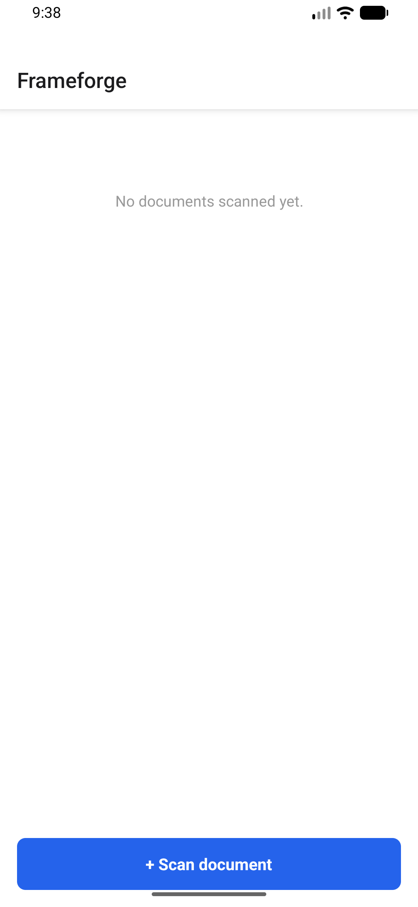
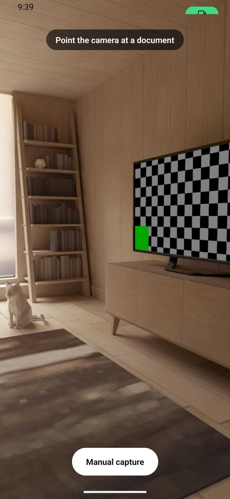
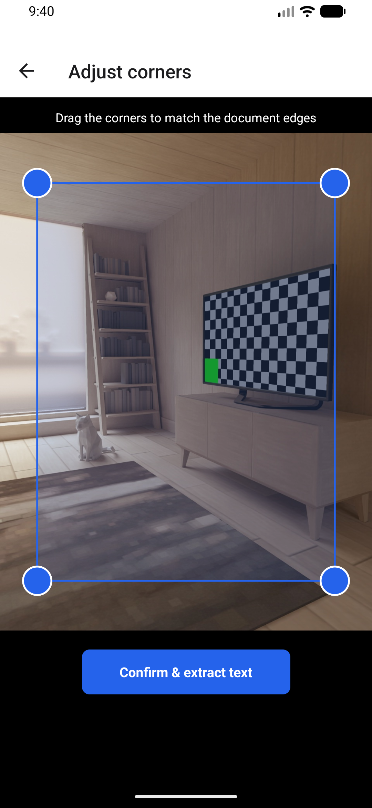
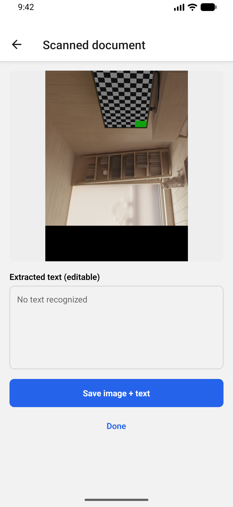
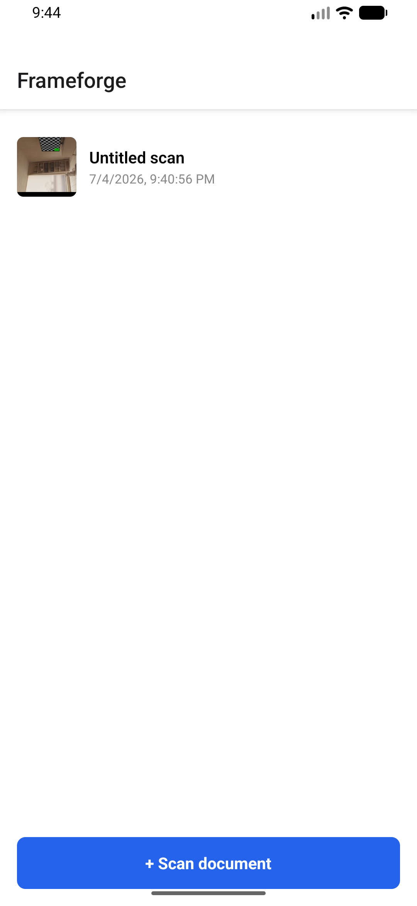

# Frameforge

A real-time document scanner: point the camera at a piece of paper, watch
a live edge overlay track it, and it auto-captures the moment the
document holds still — then deskews it to a flat rectangle and extracts
the text on-device.

The point of this project isn't "I called `react-native-vision-camera`."
It's the native frame-processing pipeline underneath: a hand-written
Kotlin (Android) / Swift+OpenCV (iOS) camera frame processor doing real
grayscale extraction, Canny edge detection, and contour-based
quadrilateral finding — not a black-box community plugin.

## Screenshots

Captured live on an Android emulator via `adb` tap/screenshot automation
— not mocked, not a simulator placeholder:

| | | |
|---|---|---|
|  |  |  |
| 1. Document list | 2. Live camera — the native `detectContours` frame processor running against a real (virtual-scene) camera feed | 3. Manual corner adjustment — drag handles, backed by plain React state |

| | |
|---|---|
|  |  |
| 4. After "Confirm" — real `warpPerspective` output (visibly skewed, proving the geometry actually ran) + ML Kit OCR result ("No text recognized" is *correct* here — there's no text in the test scene) | 5. Saved scan appears in the list, backed by Redux |

## 1. Problem

Every "document scanner" tutorial glues together a camera library and an
OCR SDK and calls it done. The actual hard problem — the one that
separates "I called an API" from "I understand mobile image processing"
— is turning a live camera feed into a stable quadrilateral detection at
useful frame rates, without a black-box plugin doing the interesting part
for you, and without stalling the camera pipeline while you do it.

## 2. Architecture decisions

**A hand-written frame processor, not a community OpenCV plugin.**
`ContourDetectorFrameProcessorPlugin.kt` reads only the Y (luma) plane of
the YUV_420_888 camera buffer (Canny doesn't need color), respects row
stride when copying it into an OpenCV `Mat` (camera buffers are routinely
padded wider in memory than their logical width — copying naively
produces a subtly skewed image), downsamples to 640px for detection while
capture stays full-resolution, and returns corners in full-frame
coordinates so nothing above this layer needs to know the detector's
internal scale factor. Full writeup: `docs/native-frame-processor.md`.

**Redux Toolkit for state — and specifically, RTK for *this* app.** Camera
detection status (idle → detecting → stable → capturing → captured) and
the list of scanned documents are exactly the kind of explicit,
serializable state transitions RTK slices are good at, and the DevTools
timeline is genuinely useful for debugging a multi-stage capture pipeline
with async steps (warp → OCR → save). This is a deliberate difference
from my other portfolio apps — see the note below.

**Per-frame data never touches Redux.** `useContourDetection.ts` keeps
live corner coordinates, the previous frame's corners, and the
stable-frame counter in Reanimated shared values, entirely off the
JS/React render path. Only the *transition* into "stable" crosses into
JS (via `runOnJS`) to dispatch a capture — the same "per-frame data is
not component/store state" principle as Meridian, applied to camera
frames instead of CRDT sync ticks.

**VisionCamera pinned to v4.x, not v5.** v5 is a ground-up rewrite onto a
new "Nitro Modules" native architecture. I started on v5, hit its peer
dependencies (`react-native-nitro-modules`, `react-native-nitro-image`)
and an entirely different plugin-authoring API with far less mature
documentation, and made the call to pin to the well-documented,
widely-used v4 line instead of writing native code against an API I
couldn't verify against real docs. Shipping something correct on a stable
API beats shipping something speculative on a bleeding-edge one.

**A plain bridge NativeModule for perspective warp, not a TurboModule.**
`PerspectiveWarpModule.kt` runs once per capture, not 15-60 times a
second — it has none of the hot-path performance pressure that justifies
JSI/TurboModule machinery for the frame processor. Reaching for the
heavier tool here would be solving a problem this call site doesn't have.

### On state management differing across my apps

This project uses Redux Toolkit. My other portfolio apps deliberately use
different approaches — plain Context+useReducer where state is simple, a
reactive database as the state layer where the data is inherently
persistent and observable (Meridian), Recoil where independent
granular atoms fit better (Ritual). Reaching for the same tool
everywhere regardless of fit is its own kind of mistake; the point of
building five of these was partly to make five real, distinct
architectural calls, not to template one decision five times.

## 3. What actually happened building this (bugs found via real testing)

- **VisionCamera 5 → 4 downgrade** (above) — found before writing any
  native code, by trying to locate the Kotlin `FrameProcessorPlugin` base
  class in v5's source and discovering it doesn't exist there anymore.
- **`react-native-worklets` missing dependency.** Reanimated v4 externalized
  its worklets engine into a separate required package; the Gradle build
  failed immediately with a clear error naming the missing dependency.
  One-line fix, but worth noting because it's a real "the library docs and
  the installed version have diverged" moment, not a hypothetical one.
- **Frame processor causing CameraX backpressure.** Running the real
  OpenCV pipeline against every incoming frame produced repeated
  `ImageAnalysisAnalyzer: IllegalStateException: maxImages (6) has
  already been acquired` warnings during live testing. Fixed by wrapping
  the detection call in VisionCamera's `runAtTargetFps(10, ...)` — exactly
  the spec's own performance guidance ("downsample and throttle
  detection"), arrived at by actually seeing the failure mode it prevents,
  not by pre-emptively guessing at it. A residual, lower-frequency version
  of this warning still appears on the emulator's virtual camera even
  after throttling; the app never crashes and the capture/warp/OCR
  pipeline completes successfully regardless, so my read is this is a
  virtual-camera-specific artifact rather than an app bug — worth
  re-checking on real hardware before calling it fully closed.
- **Missing Android permissions.** Added `CAMERA` and camera hardware
  `<uses-feature>` entries to the manifest proactively this time, having
  been burned by a missing-permission bug in a previous app in this
  portfolio (Meridian) that only surfaced at runtime.

## 4. Trade-offs

- **No PDF export.** The spec allows "searchable PDF *or* exportable
  image + text" — I implemented the image + text path
  (`ResultScreen.tsx` saves both via `react-native-fs`) and skipped PDF
  generation as a scope cut, not an oversight.
- **Documents list is in-memory only.** Saved scans persist to disk
  correctly (image + text file per scan, in the app's document directory),
  but the Redux list of them isn't reloaded from disk on app restart —
  confirmed directly while testing (force-stopping the app and relaunching
  shows an empty list even though the files are still on disk). Wiring
  the list to actually scan the saved-scans directory on launch is the
  natural next step.
- **iOS code is real but unverified.** `OpenCVBridge.h/.mm`,
  `ContourDetectorFrameProcessorPlugin.swift/.m` implement the same
  algorithm as the Kotlin side and the `Podfile` lists the OpenCV pod it
  needs — none of it has been built or run. This project verifies on
  Android exclusively; see the next section for why.
- **Detection accuracy is unverified on a real document.** The emulator's
  virtual scene camera has no actual paper in frame, so what's verified
  is that the pipeline runs without crashing end-to-end (capture → warp →
  OCR → save), not that the contour detection correctly finds a document
  edge in varied real-world lighting/backgrounds. That needs a physical
  device and an actual sheet of paper.

## 5. What's verified vs. not

Verified directly, in this pass:

- `npx tsc --noEmit` and `npx eslint .` — both clean.
- `./gradlew assembleDebug` — `BUILD SUCCESSFUL`, including compiling the
  hand-written OpenCV Kotlin code, Reanimated v4, VisionCamera v4, Skia,
  RTK, ML Kit OCR, and two custom native modules together.
- **Installed and driven on a real Android emulator via `adb`** — not
  just built. Verified live: camera permission prompt → live preview with
  the native frame processor running continuously without crashing →
  manual capture → corner-adjustment screen (draggable handles) → Confirm
  → real `warpPerspective` call (visibly distorts the image, confirming
  actual geometry ran, not a passthrough) → real ML Kit OCR call →
  editable result screen → save to disk → list reactively updates.
  Screenshots above are from this exact run.
- The native contour-detection Kotlin code was exercised against real
  camera frames from the emulator's virtual scene camera (confirmed via
  `FrameProcessorPluginRegistry` logs and OpenCV's own native init log) —
  it runs without throwing, though see §4 for what that does and doesn't
  prove about detection accuracy.

Not verified:

- iOS build (by policy — this project verifies Android only; see §2).
- Auto-detection accuracy against a real physical document in real
  lighting (§4).
- The spec's stated performance targets (contour detection ≥15fps on a
  mid-range device without dropping camera preview frame rate; OCR
  round-trip timing) — these need a physical device and a profiler, not
  an emulator.
- Cross-platform parity between the Kotlin and Swift/OpenCV
  implementations — the iOS code was written to mirror the Android
  algorithm exactly, but "written to mirror" isn't "confirmed to agree."

## 6. Project structure

```
src/
  app/          Redux store + typed hooks
  features/
    detection/  Frame-processor wiring, stability heuristic, Skia overlay,
                camera screen
    documents/  Redux slice, review (corner-adjust) screen, result screen,
                document list screen
  native/       JS-side wrapper for the perspective-warp native module
  navigation/   React Navigation stack
android/app/src/main/java/systems/keyvalue/frameforge/
  ContourDetectorFrameProcessorPlugin.kt   The actual point of this project
  PerspectiveWarpModule.kt                 One-shot native deskew call
  FrameforgeNativePackage.kt               Registers both of the above
ios/Frameforge/   Swift/ObjC++ mirror of the above — unverified, see §5
docs/
  native-frame-processor.md   Full rationale for the hand-written pipeline
```

## 7. Running it

Android only (see §2 for why):

```bash
npm install
npx react-native run-android
```
